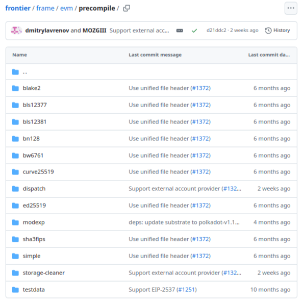

# Substrate Course | Moonbeam Architecture by OpenGuild

# 

> [!IMPORTANT]
> The repository forked from the Moonbeam codebase for the learning and referencing purpose. The codebase might not work functionally.

## Table of Contents

- [What Is This?](#what-is-this-)
- [Basic Structure of Substrate Node](#basic-structure-of-a-substrate-node)
- [Runtime Overview](#runtime-overview)
  - [Polkadot SDK Pallets](#polkadot-sdk-pallets)
  - [Frontier Pallets](#frontier-pallets)
  - [Custom Pallets](#custom-pallets)
- [Core Runtime Architecture](#core-runtime-architecture)
  - [Polkadot SDK Pallets](#polkadot-sdk-pallets-1)
    - [Utility](#utility)
    - [Balances](#balances)
    - [Timestamp](#timestamp)
    - [Transaction Payment](#transaction-payment)
    - [Randomness](#randomness)
    - [Parachain Upgrade](#parachain-upgrade)
    - [Parachain Info](#parachain-info)
  - [Frontier Pallets](#frontier-pallets-1)
    - [EVM Chain ID](#evm-chain-id)
    - [EVM Config](#evm-config)
    - [Ethereum Config](#ethereum-config)
  - [Moonbeam Specific Pallets](#moonbeam-specific-pallets)
    - [Author Inherent](#author-inherent)
    - [Parachain Staking](#parachain-staking)
  * [Precompiles](#precompiles)

## What Is This?

[Moonbeam](https://moonbeam.network/) is a [Substrate-based](https://substrate.io/) blockchain network that provides a full [Ethereum-like](https://en.wikipedia.org/wiki/Ethereum) environment. Its runtime architecture is designed to be compatible with Ethereum while leveraging the flexibility and upgradability of Substrate.

This step-by-step tutorial will breakdown Moonbeam's runtime architecture and pallet implementation.

---

## Basic Structure of a Substrate Node

Before diving into Moonbeam's specific architecture, it's important to understand the basic structure of a Substrate node, which forms the foundation for Moonbeam.

Understanding Moonbeam's architecture requires insight into how Substrate nodes function within the Polkadot parachain ecosystem. [Polkadot introduces both network sharding and execution sharding](https://blog.chungquantin.com/blog/break-down-the-sharded-network-design-of-polkadot), fundamentally shaping how parachains like Moonbeam operate.

- **Polkadot Parachain Host**: This is the foundational layer of the entire protocol, providing essential functions for building and running parachains. It serves as the backbone for parachain operations within the Polkadot ecosystem.
- **Parachain Node as WASM Blob**: In the context of Polkadot, a compiled parachain node, such as Moonbeam, is essentially a WebAssembly (WASM) blob. This compact, efficient format allows for cross-platform execution and easy deployment.
- **Availability Cores**: These WASM blobs (parachain nodes) are assigned to availability cores within the Polkadot network. These cores are responsible for executing parachain logic and maintaining the state of individual parachains.
- **Parachain-Specific Components**:
  - **Networking Layer**: Handles communication not just within the parachain, but also cross-chain messaging through Polkadot's XCMP (Cross-Chain Message Passing) protocol.
  - **Client**: Manages parachain-specific operations while also interfacing with the Polkadot relay chain for consensus and finality.
  - **Runtime**: Defines the parachain's unique logic, state transition functions, and any custom features (like Moonbeam's Ethereum compatibility).


Moonbeam, as a parachain, builds upon this structure by implementing its Ethereum-compatible environment within the Substrate framework and Polkadot ecosystem. This allows Moonbeam to leverage Polkadot's security and interoperability while providing a familiar environment for Ethereum developers.

---

## Runtime Overview

Moonbeam's runtime is built using Substrate's [FRAME](https://docs.substrate.io/reference/frame-pallets/), which allows for a modular and upgradable architecture. The runtime is composed of various components called "pallets", each responsible for specific functionality. Key components of Moonbeam's runtime architecture are as follows.

#### Polkadot SDK Pallets

Polkadot SDK pallets are responsible for the provision of core functionality, including networking, consensus, and basic runtime operations. This makes Moonbeam a [Polkadot Parachain](https://polkadot.com/parachains) that is able to live alongside, and interact seemlessly with other parachains within the Polkadot ecosystem.

From Polkadot-SDK:

- _Utility_: Allows users to use derivative accounts, and batch calls.
- _Balances_: Tracks GLMR token balances.
- _Sudo_: Allows a privileged account to make arbitrary runtime changes. This was removed before launch.
- _Timestamp_: On-Chain notion of time.
- _Transaction Payment_: Transaction payment (fee) management.
- _Randomness Collective Flip_: A (mock) onchain randomness beacon, which has been replaced by parachain randomness by mainnet.
- _ParachainUpgrade_: A helper to perform runtime upgrades on parachains.
- _ParachainInfo_: A place to store parachain-relevant constants like parachain id.

#### Frontier Pallets

Frontier pallets are a set of modules that enable Ethereum compatibility, including [Ethereum Virtual Machine](https://ethereum.org/en/developers/docs/evm/) (EVM) execution and [Remote Procedure Call](https://en.wikipedia.org/wiki/Remote_procedure_call) (RPC) compatibility.

- _EVM Chain Id_: A place to store the chain id for each Moonbeam network.
- _EVM_: Encapsulates execution logic for an Ethereum Virtual Machine.
- _Ethereum_: Ethereum-style data encoding and access for the EVM.

#### Custom Pallets

These are pallets that implement unique features and governance mechanisms. These pallets are stored in `pallets/` and they are designed for Moonbeam's specific requirements:

- _Author Inherent_: Allows block authors to include their identity in a block via an inherent.
- _Parachain Staking_: Minimal staking pallet that selects collators by total amount at stake.

---

## Core Runtime Architecture

`runtime/moonbeam/src/lib.rs` defines the Moonbeam runtime and implements the necessary pallets. This file handles the fundamental blockchain operations. Now let's take a look at how specific pallets are implemented.

### Polkadot SDK Pallets

#### Utility

The _Utility_ pallet in the Moonbeam runtime architecture serves as a framework for bundling and executing multiple calls in a single transaction.

```rust
impl pallet_utility::Config for Runtime {
	type RuntimeEvent = RuntimeEvent;
	type RuntimeCall = RuntimeCall;
	type PalletsOrigin = OriginCaller;
	type WeightInfo = moonbeam_weights::pallet_utility::WeightInfo<Runtime>;
}
```

This pallet is configured to use the runtime's custom event system (`RuntimeEvent`) for emitting events. It can make calls to other parts of the runtime using the `RuntimeCall` type, allowing it to interact with various runtime functions. The `PalletsOrigin` is set to `OriginCaller`, which defines the origin (`sender`) of utility calls. Weight calculations for the pallet's operations are handled by a custom implementation (`moonbeam_weights::pallet_utility::WeightInfo`), ensuring accurate fee estimation for utility functions. This configuration enables the Utility pallet to efficiently manage complex transactions involving multiple calls within the Moonbeam ecosystem.

#### Balances

_Balances_ pallet tracks the balances of the native GLMR token, including minting, burning, and transferring tokens.

```rust
impl pallet_balances::Config for Runtime {
	type MaxReserves = ConstU32<50>;
	type ReserveIdentifier = [u8; 4];
	type MaxLocks = ConstU32<50>;
	/// The type for recording an account's balance.
	type Balance = Balance;
	/// The ubiquitous event type.
	type RuntimeEvent = RuntimeEvent;
	type DustRemoval = ();
	type ExistentialDeposit = ExistentialDeposit;
	type AccountStore = System;
	type FreezeIdentifier = ();
	type MaxFreezes = ConstU32<0>;
	type RuntimeHoldReason = RuntimeHoldReason;
	type RuntimeFreezeReason = RuntimeFreezeReason;
	type WeightInfo = moonbeam_weights::pallet_balances::WeightInfo<Runtime>;
}
```

_Balances_ sets different `ExistentialDeposit` values based on whether runtime benchmarks are enabled (0 for normal operation, 1 for benchmarks). It allows up to 50 reserves and 50 locks per account (`MaxReserves` and `MaxLocks`). The `Balance` type is used for account balances, and `RuntimeEvent` for emitting events. The pallet doesn't implement custom dust removal (`DustRemoval = ()`) and account data is stored in the System pallet (`AccountStore = System`). Freezing is disabled (`MaxFreezes = ConstU32<0>`), but custom `RuntimeHoldReason` and `RuntimeFreezeReason` types are defined. This configuration tailors the _Balances_ pallet to Moonbeam's needs, enabling efficient management of account balances, reserves, and locks within the network.

#### Timestamp

The _Timestamp_ pallet in the runtime architecture manages onchain time.

```rust
impl pallet_timestamp::Config for Runtime {
	/// A timestamp: milliseconds since the unix epoch.
	type Moment = u64;
	type OnTimestampSet = ();
	type MinimumPeriod = ConstU64<3000>;
	type WeightInfo = moonbeam_weights::pallet_timestamp::WeightInfo<Runtime>;
}
```

_Timestamp_ uses a `u64` type to represent time as milliseconds since the Unix epoch (`Moment = u64`). It doesn't specify any custom logic to execute when the timestamp is set (`OnTimestampSet = ()`). The `MinimumPeriod` is set to 3000 milliseconds (3 seconds), which is the minimum time required between blocks. This prevents timestamp manipulation by malicious validators and ensures a consistent block time.

#### Transaction Payment

The _Transaction Payment_ pallet manages the fee calculation and payment for transactions.

```rust
impl pallet_transaction_payment::Config for Runtime {
	type RuntimeEvent = RuntimeEvent;
	type OnChargeTransaction = FungibleAdapter<Balances, DealWithFees<Runtime>>;
	type OperationalFeeMultiplier = ConstU8<5>;
	type WeightToFee = ConstantMultiplier<Balance, ConstU128<{ currency::WEIGHT_FEE }>>;
	type LengthToFee = LengthToFee;
	type FeeMultiplierUpdate = SlowAdjustingFeeUpdate<Runtime>;
}
```

_Transaction Payment_ uses a custom `LengthToFee` struct to calculate fees based on transaction length, employing a polynomial function with two coefficients: one linear (based on `TRANSACTION_BYTE_FEE`) and one cubic (using `SUPPLY_FACTOR`). The `RuntimeEvent` type is used for emitting events. Transaction charges are handled by the `FungibleAdapter` using the _Balances_ pallet and a custom `DealWithFees` type. Operational transactions have a fee multiplier of 5 (`OperationalFeeMultiplier = ConstU8<5>`). Weight-to-fee conversion uses a constant multiplier based on `WEIGHT_FEE`. _Transaction Payment_ pallet also employs a `FastAdjustingFeeUpdate` mechanism to dynamically adjust fees. This enables the pallet to calculate and collect fees efficiently, considering both transaction weight and length, while allowing for dynamic fee adjustments in the Moonbeam network.

#### Randomness

_Randomness_ provides a source of randomness for the network.

```rust
impl pallet_randomness::Config for Runtime {
	type RuntimeEvent = RuntimeEvent;
	type AddressMapping = sp_runtime::traits::ConvertInto;
	type Currency = Balances;
	type BabeDataGetter = BabeDataGetter<Runtime>;
	type VrfKeyLookup = AuthorMapping;
	type Deposit = ConstU128<{ 1 * currency::GLMR * currency::SUPPLY_FACTOR }>;
	type MaxRandomWords = ConstU8<100>;
	type MinBlockDelay = ConstU32<2>;
	type MaxBlockDelay = ConstU32<2_000>;
	type BlockExpirationDelay = ConstU32<10_000>;
	type EpochExpirationDelay = ConstU64<10_000>;
	type WeightInfo = moonbeam_weights::pallet_randomness::WeightInfo<Runtime>;
}
```

Using a custom `BabeDataGetter`, _Randomness_ retrieves epoch index and randomness from the relay chain, with special handling for benchmarking scenarios. It interfaces with the _Balances_ pallet for currency operations and `AuthorMapping` for [Verifiable Random Function](https://en.wikipedia.org/wiki/Verifiable_random_function) (VRF) key lookups. The configuration sets a deposit of 1 UNIT \* SUPPLY_FACTOR for randomness requests, limits the maximum random words to 100 per request, and defines block delays (minimum 2, maximum 2,000) for randomness fulfillment. It also sets expiration delays for blocks (10,000) and epochs (10,000). This setup allows the **Randomness** pallet to provide secure, onchain randomness for various applications within the Moonbeam network, balancing between immediacy and security in randomness generation.

#### Parachain Upgrade

The _Parachain Upgrade_ pallet, formally known as the Cumulus Parachain System pallet, manages crucial aspects of Moonbeam's operation as a parachain in the Polkadot ecosystem.

```rust
impl cumulus_pallet_parachain_system::Config for Runtime {
	type RuntimeEvent = RuntimeEvent;
	type OnSystemEvent = ();
	type SelfParaId = ParachainInfo;
	type ReservedDmpWeight = ReservedDmpWeight;
	type OutboundXcmpMessageSource = XcmpQueue;
	type XcmpMessageHandler = XcmpQueue;
	type ReservedXcmpWeight = ReservedXcmpWeight;
	type CheckAssociatedRelayNumber = EmergencyParaXcm;
	type ConsensusHook = ConsensusHookWrapperForRelayTimestamp<Runtime, ConsensusHook>;
	type DmpQueue = frame_support::traits::EnqueueWithOrigin<MessageQueue, RelayOrigin>;
	type WeightInfo = moonbeam_weights::cumulus_pallet_parachain_system::WeightInfo<Runtime>;
}
```

This pallet uses the runtime's event system (`RuntimeEvent`) and relies on `ParachainInfo` for self-identification. It handles cross-chain message passing (XCMP) using the `XcmpQueue` for both outbound messages and message handling. This reserves weights for Downward Message Passing (DMP) and XCMP to ensure resource availability. It employs `EmergencyParaXcm` for relay chain block number checks and uses a custom `ConsensusHook` wrapper for timestamp-related consensus operations. Downward messages are processed through a `MessageQueue` with `RelayOrigin`.

#### Parachain Info

```rust
impl parachain_info::Config for Runtime {}
```

The _Parachain Info_ pallet serves a simple but crucial purpose. Despite its minimal configuration (`impl parachain_info::Config for Runtime {}`), this pallet provides essential information about Moonbeam's identity as a parachain. It stores and allows access to the parachain's ID within the Polkadot ecosystem. This ID is a crucial piece of information used by other pallets and runtime components to facilitate cross-chain communication, parachain-specific operations, and interactions with the relay chain. The empty implementation suggests that Moonbeam uses the default behavior of this pallet without any custom modifications, relying on its standard functionality to maintain and provide access to the parachain's identity information.

### Frontier Pallets

#### EVM Chain ID

```rust
impl pallet_evm_chain_id::Config for Runtime {}
```

The Frontier _EVM Chain ID_ pallet configuration (`impl pallet_evm_chain_id::Config for Runtime {}`), stores and manages the EVM chain ID for the Moonbeam network. This chain ID is a unique identifier that distinguishes Moonbeam from other EVM-compatible networks, ensuring that transactions signed for Moonbeam cannot be replayed on other networks and vice versa. The empty implementation indicates that Moonbeam uses the default behavior of this pallet without customization, relying on its standard functionality to maintain and provide access to the EVM chain ID, which is essential for proper transaction processing and network identification in Ethereum-compatible operations.

#### EVM Config

_EVM_ is a crucial pallet for implementing EVM compatibility.

```rust
impl pallet_evm::Config for Runtime {
	type FeeCalculator = TransactionPaymentAsGasPrice;
	type GasWeightMapping = pallet_evm::FixedGasWeightMapping<Self>;
	type WeightPerGas = WeightPerGas;
	type BlockHashMapping = pallet_ethereum::EthereumBlockHashMapping<Self>;
	type CallOrigin = EnsureAddressRoot<AccountId>;
	type WithdrawOrigin = EnsureAddressNever<AccountId>;
	type AddressMapping = IdentityAddressMapping;
	type Currency = Balances;
	type RuntimeEvent = RuntimeEvent;
	type Runner = pallet_evm::runner::stack::Runner<Self>;
	type PrecompilesType = MoonbeamPrecompiles<Self>;
	type PrecompilesValue = PrecompilesValue;
	type ChainId = EthereumChainId;
	type OnChargeTransaction = OnChargeEVMTransaction<DealWithFees<Runtime>>;
	type BlockGasLimit = BlockGasLimit;
	type FindAuthor = FindAuthorAdapter<AuthorInherent>;
	type OnCreate = ();
	type GasLimitPovSizeRatio = GasLimitPovSizeRatio;
	type SuicideQuickClearLimit = ConstU32<0>;
	type GasLimitStorageGrowthRatio = GasLimitStorageGrowthRatio;
	type Timestamp = RelayTimestamp;
	type WeightInfo = moonbeam_weights::pallet_evm::WeightInfo<Runtime>;
}
```

`TransactionPaymentAsGasPrice` is used for fee calculation and a fixed gas-to-weight mapping. It employs `EthereumBlockHashMapping` for block hash lookups and restricts call origins to root addresses while preventing direct withdrawals. _EVM_ further leverages _Balances_ for currency operations and a stack-based runner for EVM execution. It integrates Moonbeam-specific precompiles and uses the `EthereumChainId` for network identification. Transaction charging is handled by a custom `OnChargeEVMTransaction` implementation.

_EVM_ also sets a block gas limit and uses `FindAuthorAdapter` for author discovery. It implements a gas limit ratio based on proof-of-validity size and storage growth and the relay chain's timestamp and Moonbeam-specific weight calculations are used here.

This configuration enables Moonbeam to run Ethereum-compatible smart contracts and transactions, providing a seamless bridge between Substrate and Ethereum ecosystems.

#### Ethereum Config

This pallet enables Ethereum-compatible functionality within the Substrate framework.

```rust
impl pallet_ethereum::Config for Runtime {
	type RuntimeEvent = RuntimeEvent;
	type StateRoot = pallet_ethereum::IntermediateStateRoot<Self>;
	type PostLogContent = PostBlockAndTxnHashes;
	type ExtraDataLength = ConstU32<30>;
}
```

_Ethereum_ uses the runtime's event system (`RuntimeEvent`) for emitting Ethereum-related events. It employs `IntermediateStateRoot` for calculating state roots, which is crucial for maintaining Ethereum-compatible state transitions. The PostLogContent is set to `PostBlockAndTxnHashes`, for logging block and transaction hashes after processing. The `ExtraDataLength` is set to a constant 30 bytes, defining the maximum length of extra data that can be included in a block header.

This configuration allows Moonbeam to process Ethereum transactions and smart contracts, maintain Ethereum-compatible state, and produce Ethereum-like blocks and receipts, effectively bridging the gap between Substrate and Ethereum ecosystems within the Moonbeam network.

### Moonbeam Specific Pallets

#### Author Inherent

_Author Inherent_ manages the selection and verification of block authors.

```rust
impl pallet_author_inherent::Config for Runtime {
	type SlotBeacon = RelaychainDataProvider<Self>;
	type AccountLookup = MoonbeamOrbiters;
	type CanAuthor = AuthorFilter;
	type AuthorId = AccountId;
	type WeightInfo = moonbeam_weights::pallet_author_inherent::WeightInfo<Runtime>;
}
```

This pallet uses `RelaychainDataProvider<Self>` as the `SlotBeacon`, to synchronize with the Polkadot relay chain for slot timing. `MoonbeamOrbiters` is used for `AccountLookup`, suggesting a custom system for mapping between different account representations. The `CanAuthor` trait is implemented by `AuthorFilter`, which determines which accounts are eligible to author blocks. The `AuthorId` is set to `AccountId`, an implementation of [`AccountId20`](https://github.com/moonbeam-foundation/moonbeam/blob/850be5542c341a9571e406730e1ee60dd9869df6/runtime/moonbeam/src/lib.rs#L31C1-L31C26), indicating that block authors are identified by their account IDs.

This configuration enables Moonbeam to manage block authorship in a parachain context, ensuring that only eligible authors can produce blocks and that the authorship process aligns with the broader Polkadot ecosystem's timing and consensus mechanisms.

#### Parachain Staking

_Parachain Staking_ pallet manages the Moonbeam network's [Delegated Proof-of-Stake](https://docs.moonbeam.network/builders/substrate/interfaces/features/staking/) system for selecting and rewarding collators.

```rust
impl pallet_parachain_staking::Config for Runtime {
	type RuntimeEvent = RuntimeEvent;
	type Currency = Balances;
	type MonetaryGovernanceOrigin = MonetaryGovernanceOrigin;
	/// Minimum round length is 2 minutes (10 * 12 second block times)
	type MinBlocksPerRound = ConstU32<10>;
	/// If a collator doesn't produce any block on this number of rounds, it is notified as inactive
	type MaxOfflineRounds = ConstU32<1>;
	/// Rounds before the collator leaving the candidates request can be executed
	type LeaveCandidatesDelay = ConstU32<{ 4 * 7 }>;
	/// Rounds before the candidate bond increase/decrease can be executed
	type CandidateBondLessDelay = ConstU32<{ 4 * 7 }>;
	/// Rounds before the delegator exit can be executed
	type LeaveDelegatorsDelay = ConstU32<{ 4 * 7 }>;
	/// Rounds before the delegator revocation can be executed
	type RevokeDelegationDelay = ConstU32<{ 4 * 7 }>;
	/// Rounds before the delegator bond increase/decrease can be executed
	type DelegationBondLessDelay = ConstU32<{ 4 * 7 }>;
	/// Rounds before the reward is paid
	type RewardPaymentDelay = ConstU32<2>;
	/// Minimum collators selected per round, default at genesis and minimum forever after
	type MinSelectedCandidates = ConstU32<8>;
	/// Maximum top delegations per candidate
	type MaxTopDelegationsPerCandidate = ConstU32<300>;
	/// Maximum bottom delegations per candidate
	type MaxBottomDelegationsPerCandidate = ConstU32<50>;
	/// Maximum delegations per delegator
	type MaxDelegationsPerDelegator = ConstU32<100>;
	/// Minimum stake required to be reserved to be a candidate
	type MinCandidateStk = ConstU128<{ 20_000 * currency::GLMR * currency::SUPPLY_FACTOR }>;
	/// Minimum stake required to be reserved to be a delegator
	type MinDelegation = ConstU128<{ 500 * currency::MILLIGLMR * currency::SUPPLY_FACTOR }>;
	type BlockAuthor = AuthorInherent;
	type OnCollatorPayout = ();
	type PayoutCollatorReward = PayoutCollatorOrOrbiterReward;
	type OnInactiveCollator = OnInactiveCollator;
	type OnNewRound = OnNewRound;
	type SlotProvider = RelayChainSlotProvider;
	type WeightInfo = moonbeam_weights::pallet_parachain_staking::WeightInfo<Runtime>;
	type MaxCandidates = ConstU32<200>;
	type SlotDuration = ConstU64<6_000>;
	type BlockTime = ConstU64<6_000>;
}
```

This pallet uses _Balances_ for currency operations and allows monetary governance actions through a custom origin. It sets a minimum round length of 10 blocks (2 minutes) and considers a collator inactive after 1 offline round. Most staking actions (leaving candidacy, bond adjustments, delegator exits) have a 28-round delay (4 weeks), while reward payments have a 2-round delay. The system supports up to 200 candidates, with a minimum of 8 selected per round. Each candidate can have up to 300 top and 50 bottom delegations, while delegators can delegate to up to 100 candidates. The minimum stake is 20,000 GLMR for candidates and 500 milliGLMR for delegators, both adjusted by a supply factor.

_Parachain Staking_ integrates custom implementations for collator rewards, inactive collator handling, and new round notifications, supporting Moonbeam's orbiter system. It uses the relay chain for slot timing (6-second slots) and Moonbeam-specific weight calculations. This configuration enables Moonbeam to operate a secure and flexible staking system tailored to its parachain needs.

These core runtime pallets ensure that local and cross-chain transactions are executed without constraint. Next, let's take a look at essential supporting components called **Precompiles**. These are not core runtime components but rather pre-defined processes that ensure effective runtime operations.

---

## Precompiles

Precompiles refer to specialized functions or contracts that are hardcoded into the blockchain protocol rather than being written in any high-level smart contract language. These precompiles are executed natively by the EVM for performance-critical operations.

```rust
mod migrations;
mod precompiles;
pub use precompiles::{
	MoonbeamPrecompiles, PrecompileName, FOREIGN_ASSET_PRECOMPILE_ADDRESS_PREFIX,
};
```

Moonbeam implements custom precompiles through the `MoonbeamPrecompiles` struct, which contains a set of predefined Ethereum-compatible contracts with optimized implementations. These precompiles are accessible at specific addresses within the EVM, allowing efficient execution of common operations.

The architecture includes a `PrecompileName` enum, a standardized way to reference and manage different precompiles. The `FOREIGN_ASSET_PRECOMPILE_ADDRESS_PREFIX` indicates support for interacting with assets from other chains, highlighting Moonbeam's cross-chain capabilities. By using precompiles, Moonbeam can offer enhanced performance for specific operations, extend the EVM's native functionality, and provide seamless integration with its unique features and cross-chain interactions, all while maintaining Ethereum compatibility.

Ethereum precompiled contracts offer advanced functionalities, including computationally intensive tasks like hashing and encryption. On Moonbeam, custom precompiled contracts extend this capability by providing access to Substrate-specific features such as staking, governance, XCM-related functions, and more.

Moonbeam’s unique precompiles can be accessed using familiar Solidity interfaces through the Ethereum API, allowing seamless interaction with the underlying Substrate interfaces. The following screenshot shows the various folders holding each unique precompile in the Substrate FRAME code repository.



In the following subsections, we'll look at categories of precompiles and their exact addresses.

### Precompiled Contract Addresses

The precompiled contracts on Moonbeam are categorized by their addresses and the originating network. When converted to decimal format, these addresses can be grouped into the following categories:

- `0`-`1023`: Ethereum MainNet precompiles
- `1024`-`2047`: Precompiles not specific to Ethereum or Moonbeam
- `2048`-`4095`: Moonbeam-specific precompiles

#### Ethereum MainNet Precompiles

| Contract               | Address                                    |
| ---------------------- | ------------------------------------------ |
| ECRECOVER              | 0x0000000000000000000000000000000000000001 |
| SHA256                 | 0x0000000000000000000000000000000000000002 |
| RIPEMD160              | 0x0000000000000000000000000000000000000003 |
| Identity               | 0x0000000000000000000000000000000000000004 |
| Modular Exponentiation | 0x0000000000000000000000000000000000000005 |
| BN128Add               | 0x0000000000000000000000000000000000000006 |
| BN128Mul               | 0x0000000000000000000000000000000000000007 |
| BN128Pairing           | 0x0000000000000000000000000000000000000008 |
| Blake2                 | 0x0000000000000000000000000000000000000009 |

#### Non-Ethereum and Non-Moonbeam Specific Precompiles

| Contract           | Address                                    |
| ------------------ | ------------------------------------------ |
| SHA3FIPS256        | 0x0000000000000000000000000000000000000400 |
| Dispatch           | 0x0000000000000000000000000000000000000401 |
| ECRecoverPublicKey | 0x0000000000000000000000000000000000000402 |

#### Moonbeam-Specific Precompiles

| Contract                                 | Address                                    |
| ---------------------------------------- | ------------------------------------------ |
| Parachain Staking                        | 0x0000000000000000000000000000000000000800 |
| Crowdloan Rewards                        | 0x0000000000000000000000000000000000000801 |
| ERC-20 Interface                         | 0x0000000000000000000000000000000000000802 |
| Democracy [Removed]                      | 0x0000000000000000000000000000000000000803 |
| X-Tokens                                 | 0x0000000000000000000000000000000000000804 |
| Relay Encoder                            | 0x0000000000000000000000000000000000000805 |
| XCM Transactor V1                        | 0x0000000000000000000000000000000000000806 |
| Author Mapping                           | 0x0000000000000000000000000000000000000807 |
| Batch                                    | 0x0000000000000000000000000000000000000808 |
| Randomness                               | 0x0000000000000000000000000000000000000809 |
| Call Permit                              | 0x000000000000000000000000000000000000080a |
| Proxy                                    | 0x000000000000000000000000000000000000080b |
| XCM Utilities                            | 0x000000000000000000000000000000000000080C |
| XCM Transactor V2                        | 0x000000000000000000000000000000000000080d |
| Council Collective [Removed]             | 0x000000000000000000000000000000000000080e |
| Technical Committee Collective [Removed] | 0x000000000000000000000000000000000000080f |
| Treasury Council Collective              | 0x0000000000000000000000000000000000000810 |
| Referenda                                | 0x0000000000000000000000000000000000000811 |
| Conviction Voting                        | 0x0000000000000000000000000000000000000812 |
| Preimage                                 | 0x0000000000000000000000000000000000000813 |
| OpenGov Tech Committee                   | 0x0000000000000000000000000000000000000814 |
| Precompile Registry                      | 0x0000000000000000000000000000000000000815 |
| GMP                                      | 0x0000000000000000000000000000000000000816 |
| XCM Transactor V3                        | 0x0000000000000000000000000000000000000817 |
| XCM Interface                            | 0x000000000000000000000000000000000000081A |
| Identity                                 | 0x0000000000000000000000000000000000000818 |

---

## Conclusion

The Moonbeam runtime architecture is a sophisticated blend of Substrate and Ethereum-compatible components, allowing for extensive functionality, flexibility, and security within the Moonbeam network. By integrating various pallets and precompiled contracts, Moonbeam provides access to essential features like staking, governance, XCM-related functions, and secure randomness generation.

The categorized precompiled contracts further enhance network capabilities, offering tailored functionalities specific to Moonbeam, as well as compatibility with established Ethereum standards. This structure enables developers to leverage familiar tools and APIs while benefiting from the advanced features of Substrate. Overall, the Moonbeam runtime is designed to optimize performance and adaptability, ensuring a robust environment for decentralized applications and parachain operations. ​

---

## References

1. [Moonbeam Documentation](https://docs.moonbeam.network/)
2. [Substrate Documentation](https://docs.substrate.io/)
3. [Polkadot Litepaper](https://assets.polkadot.network/Polkadot-lightpaper.pdf)
4. [Moonbeam GitHub Repository](https://github.com/moonbeam-foundation/moonbeam)
5. [Substrate GitHub Repository](https://github.com/paritytech/substrate)
6. [Polkadot GitHub Repository](https://github.com/paritytech/polkadot)
7. [Frontier GitHub Repository](https://github.com/polkadot-evm/frontier)
8. [Parachain Development Guide](https://wiki.polkadot.network/docs/build-pdk)
9. [FRAME Pallets Documentation](https://docs.substrate.io/reference/frame-pallets/)
10. [WebAssembly (WASM) Specification](https://wiki.polkadot.network/docs/learn-wasm)
11. [Cross-Chain Message Passing (XCMP) Protocol Documentation](https://wiki.polkadot.network/docs/learn-xcm)
12. [Ethereum Virtual Machine (EVM) Specification](https://ethereum.org/en/developers/docs/evm/)
13. [Moonbeam Precompiles Documentation](https://docs.moonbeam.network/builders/ethereum/precompiles/overview/)
14. [Polkadot Parachain Host Specification](https://paritytech.github.io/polkadot-sdk/book/index.html)
15. [Polkadot Consensus Mechanism Overview](https://polkadot.com/blog/polkadot-consensus-part-1-enhanced-economic-security-via-npos)
16. [Substrate Networks](https://blog.chungquantin.com/blog/break-down-the-sharded-network-design-of-polkadot)

This list of references covers key resources related to Moonbeam's architecture, its underlying Substrate framework, the broader Polkadot ecosystem, and relevant Ethereum specifications used in this tutorial. It includes official documentation, whitepapers, GitHub repositories, and specific guides that would be valuable for understanding the topics discussed.
